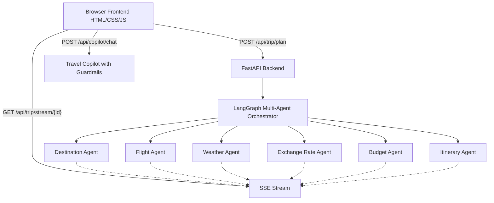

<div align="center">
  <h1>🌍 Travel Verse: Multi-Agent Travel Planner</h1>
  <p>
    <b>An AI-powered, multi-agent travel planning system featuring real-time Server-Sent Events (SSE) streaming and a travel copilot.</b>
  </p>
  <p>
    <a href="#features">Features</a> •
    <a href="#architecture">Architecture</a> •
    <a href="#tech-stack">Tech Stack</a> •
    <a href="#setup--installation">Installation</a> •
    <a href="#usage">Usage</a>
  </p>
</div>

---

## 🚀 About The Project

**Travel Verse** is an advanced AI travel planning system that leverages multiple autonomous agents to design the perfect trip for you. From selecting destinations and finding flights to checking the weather and calculating budgets, a specialized team of AI agents works together to build a comprehensive itinerary.

The frontend is a beautifully designed, responsive web application that uses a modern Bento grid layout and real-time Server-Sent Events (SSE) to show you exactly what each AI agent is doing as they plan your trip!

---

## ✨ Features

- **🤖 Multi-Agent AI Architecture**: 6 specialized agents working together:
  - 📍 *Destination Agent*
  - ✈️ *Flight Agent*
  - 🌤️ *Weather Agent*
  - 💱 *Exchange Rate Agent*
  - 💰 *Budget Calculation Agent*
  - 📅 *Itinerary Agent*
- **⚡ Real-time SSE Streaming**: Watch your itinerary being built live as each agent completes its task.
- **💬 Travel Copilot**: A built-in chat assistant with strict travel-only guardrails to answer questions about your trip.
- **🎨 Modern Bento Grid UI**: A stunning dark/light mode interface designed with pure HTML/CSS/JS.
- **🚀 High-Performance Backend**: Built with FastAPI for blazing fast API responses.

---

## 🏗️ Architecture



---

## 💻 Tech Stack

**Frontend:**
- HTML5 / CSS3 / Vanilla JavaScript
- Modern Bento Grid Layout
- Server-Sent Events (SSE) Client

**Backend:**
- Python 3
- [FastAPI](https://fastapi.tiangolo.com/) (Web Framework)
- [LangChain](https://www.langchain.com/) / [LangGraph](https://langchain-ai.github.io/langgraph/) (Agent Orchestration)
- Uvicorn (ASGI Server)
- Pydantic (Data Validation)

---

## ⚙️ Setup & Installation

### Prerequisites
- Python 3.9+
- Pip / Virtualenv
- OpenAI API Key (or other supported LLM provider keys)

### Installation Steps

1. **Clone the repository**
   ```bash
   git clone https://github.com/yourusername/TravelPlanner.git
   cd TravelPlanner
   ```

2. **Set up a virtual environment**
   ```bash
   python -m venv .venv
   # Windows:
   .venv\Scripts\activate
   # macOS/Linux:
   source .venv/bin/activate
   ```

3. **Install dependencies**
   ```bash
   pip install -r requirements.txt
   ```

4. **Environment Variables**
   Ensure your `.env` file is properly configured with your API keys:
   ```env
   OPENAI_API_KEY=your_openai_api_key
   # Add other required API keys for weather, flights, etc.
   ```

5. **Run the server**
   ```bash
   uvicorn api.main:app --reload --port 8000
   ```

6. **Open the App**
   Navigate to [http://localhost:8000](http://localhost:8000) in your web browser.

---

## 📖 Usage

1. **Plan a Trip**: Enter your origin, destination, travel dates, and budget into the beautiful Hero form.
2. **Watch the Agents Work**: See a real-time progress animation as the Destination, Flight, Weather, Exchange, Budget, and Itinerary agents process your request.
3. **View the Results**: Explore your trip details rendered in a responsive Bento grid.
4. **Chat with Copilot**: Ask specific travel-related questions using the built-in Copilot widget.

---

## 🤝 Contributing

Contributions, issues, and feature requests are welcome!
Feel free to check [issues page](https://github.com/yourusername/TravelPlanner/issues) if you want to contribute.

1. Fork the Project
2. Create your Feature Branch (`git checkout -b feature/AmazingFeature`)
3. Commit your Changes (`git commit -m 'Add some AmazingFeature'`)
4. Push to the Branch (`git push origin feature/AmazingFeature`)
5. Open a Pull Request

---

## 📝 License

Distributed under the MIT License. See `LICENSE` for more information.

---
<div align="center">
  <i>Built with ❤️ using LangGraph and FastAPI</i>
</div>
